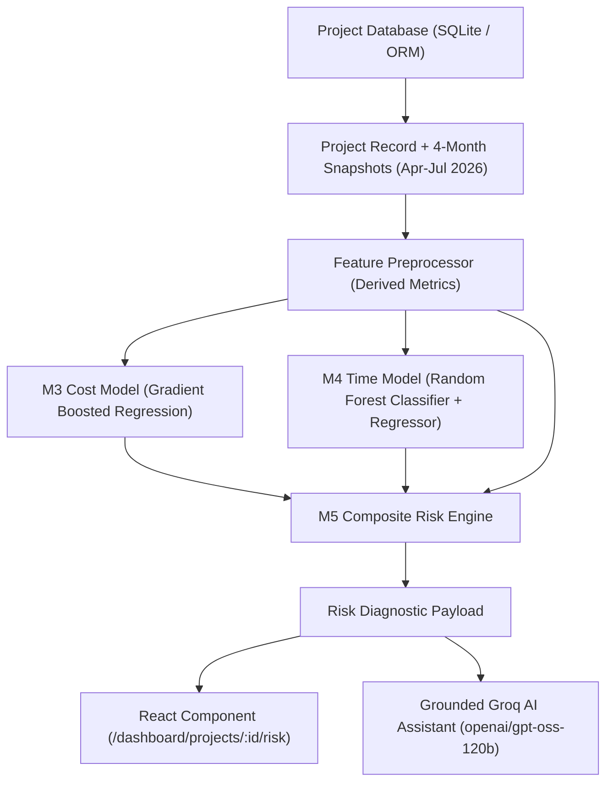

# InfraGuard-AI: Individual Project Risk Assessment Architecture

## 1. Executive Summary

The **Individual Project Risk Assessment Page** (`/dashboard/projects/:id/risk`) delivers an automated, deep-dive forensic diagnostic for any infrastructure project monitored under the PAIMANA / MoSPI portal. 

When a project monitoring authority, ministry official, or auditor navigates to a project from the **Projects Directory**, **Project Details**, **Risk Assessment Dashboard**, or **Search**, clicking **`[ Risk Assessment ]`** opens this forensic diagnostic page for that specific project.

---

## 2. Core Constraints & Design Directives

1. **Zero Geographic/Map Visualizations**:
   - In accordance with the system specification, no Indian or geographic map is rendered on this page.
   - Spatial and institutional context is conveyed strictly through official MoSPI administrative metadata:
     - **Ministry** (e.g., Ministry of Railways, Ministry of Road Transport & Highways)
     - **Implementing Agency** (e.g., NHAI, RVNL, NTPC)
     - **State / Union Territory**
     - **Sector** (e.g., Highways, Power, Railways)

2. **100% Real Backend & Model Predictions**:
   - Zero hard-coded or fabricated metrics.
   - All historical data flows from monthly PAIMANA snapshots (April 2026, May 2026, June 2026, July 2026).
   - Cost predictions flow from **M3 Cost Prediction Model** (`models/cost_prediction_model.pkl`).
   - Time predictions flow from **M4 Time Prediction Model** (`models/time_classifier.pkl` and `models/time_regressor.pkl`).
   - Overall risk scores flow from **M5 Composite Risk Engine**.
   - AI conversational responses flow from **Groq LLM** (`openai/gpt-oss-120b`), context-grounded in the project's database records.

---

## 3. End-to-End Data Pipeline

---

## 4. UI Architecture & The 12 Forensic Modules

### Module 1: Header & Context Navigation
- MoSPI Administrative Badges: Ministry, Implementing Agency, State/UT, Sector.
- Project Code badge and Overall Risk Category pill (`CRITICAL`, `HIGH`, `MEDIUM`, `LOW`).
- Action Controls:
  - `[ ← Projects Directory ]`: Back navigation.
  - `[ Re-run ML ]`: Re-evaluates live M3/M4/M5 inference against recent snapshots.
  - `[ Project Details ]`: Direct link to `/dashboard/projects/:id`.
  - `[ Export / Print Report ]`: Triggers print stylesheet for physical executive briefing dossiers.

### Module 2: Overall Composite Risk Header
- **0–100 Radial Gauge**: Visualizes composite risk index computed by M5.
- **Category Badge**:
  - `CRITICAL` (75–100): Red, immediate executive intervention required.
  - `HIGH` (50–74): Amber, high oversight alert.
  - `MEDIUM` (25–49): Yellow, monitored variance.
  - `LOW` (0–24): Green, on-track baseline.
- **Key Status Indicators**:
  - Cost Risk Level + Overrun %
  - Time Risk Level + Delay in Months + Probability %
  - Financial-Physical Progress Gap %
  - Active Early Warning signals count

### Module 3: Project Status Snapshot (6 KPI Cards)
- **Original Approved Cost** (₹ Crore): Sanctioned baseline.
- **Latest Revised Cost** (₹ Crore): Cumulative escalation with % overrun.
- **Cumulative Expenditure** (₹ Crore): Disbursed funds and budget utilization %.
- **Physical Progress** (%): On-ground milestone execution with progress bar.
- **Target Completion Date**: Original vs Latest revised target.
- **Health Status Classification**: Automated tiering based on velocity and variance.

### Module 4: 4-Month Historical Trajectory & Recharts Graphs
Displays all 4 monthly snapshots (April, May, June, July 2026) in a data register and 4 visual Recharts charts:
1. **Physical Progress vs Month**: Monotone line chart of milestone completion trajectory.
2. **Cumulative Expenditure vs Month**: Area chart tracking capital deployment.
3. **Physical Progress vs Cumulative Outlay**: Dual-axis composed chart highlighting whether capital expenditure is leading or lagging physical works.
4. **Expenditure % vs Physical Progress % (Gap Trajectory)**: Bar chart visualizing progress gap over time.

### Module 5: Cost Risk Analysis (M3 Model)
- Compares Original Cost, Revised Cost, Cumulative Outlay, and **M3 Predicted Total Cost**.
- Computes Additional Funds Required to reach 100% completion.
- Evaluates cost risk level (`LOW`, `MEDIUM`, `HIGH`).

### Module 6: Schedule Delay Analysis (M4 Model)
- Compares Original Target Date, Revised Target Date, and **M4 Forecasted Completion Date**.
- Displays delay probability (%) and expected delay in months.
- Assesses critical path schedule bottleneck probability.

### Module 7 & 8: Performance Indicators & Active Early Warnings
- Lists triggered early warnings (e.g. *Critical Cost Overrun Predicted*, *High Time Overrun Predicted*, *Severe Expenditure/Progress Mismatch*).
- Breakdown of specific risk factors with severity impact ratings.

### Module 9: Cost vs Time Risk Matrix (4×4 Grid)
- 4×4 coordinate plane mapping:
  - **Y-Axis**: Cost Risk (`Low`, `Medium`, `High`, `Critical`)
  - **X-Axis**: Time Risk (`Low`, `Medium`, `High`, `Critical`)
- Clearly highlights **THIS specific project's coordinate cell** with an active marker, project code label, and score badge.

### Module 10: Technical Model Insights Accordion
- Collapsible audit drawer for engineers and auditors:
  - M3 pipeline details (gradient boosting, input feature set).
  - M4 dual-head classification/regression architecture.
  - M5 composite scoring weights formula:
    $$\text{Score} = \min(100, 0.4 \times \text{Cost} + 0.3 \times \text{Time} + 0.2 \times \text{Gap} + 0.1 \times \text{Lag})$$

### Module 11: Grounded Ask InfraGuard-AI Assistant
- Integrated conversational assistant pre-grounded in this specific project's data.
- Suggestion chips:
  - *"Why is this project classified at this risk level?"*
  - *"What is the expected delay and cost overrun?"*
  - *"What are the early warnings and recommended mitigation actions?"*
  - *"Summarize progress trajectory over the last 4 months"*
- Connects to `POST /api/ai/chat` powered by Groq `openai/gpt-oss-120b`.

### Module 12: Executive Report Export & Print Stylesheet
- Fully responsive print stylesheet (`@media print`) that removes interactive navigation bars, buttons, and input fields to output an executive 2-page briefing document.

---

## 5. Security & RBAC Enforcement

1. **Role-Based Access Control**:
   - Access to `/dashboard/projects/:id/risk` enforces user scope: National Portfolio, Ministry Scope, State/Regional Scope, or Implementing Agency Scope.
   - Any access attempt outside authorized scope returns HTTP 403 Forbidden.
2. **API Key Isolation**:
   - `GROQ_API_KEY` is strictly preserved server-side in `.env`.
   - The browser client interacts solely through authenticated JWT bearer tokens.

