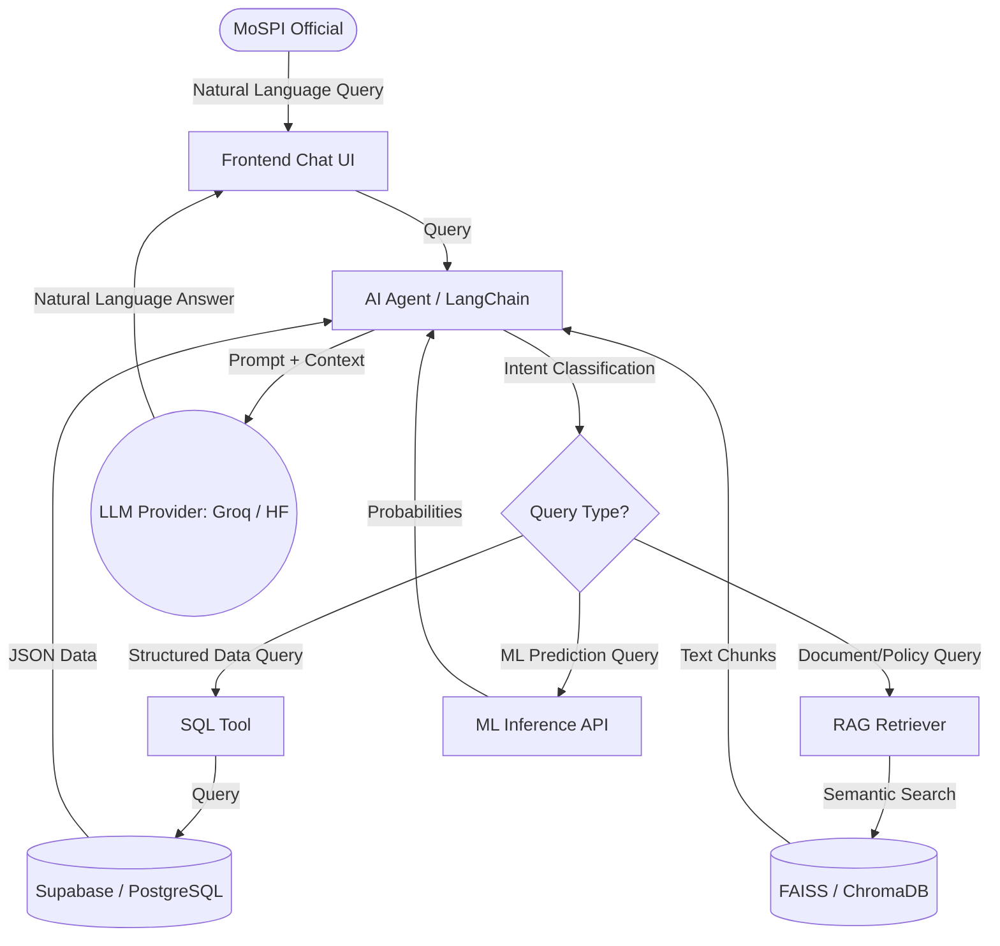

# AI Architecture (Member 6)

This document outlines the architecture for integrating Machine Learning predictions and Large Language Model (LLM) intelligence into the InfraGuard-AI platform.

## Core Principle: Separation of Concerns

The PAIMANA AI Assistant must not hallucinate numerical values, ML probabilities, or project statuses. To achieve this, the architecture strictly separates numerical retrieval from natural language generation.

1. **STRUCTURED DATABASE**: Supabase (PostgreSQL) is the absolute source of truth for all numerical project data, KPIs, and calculated risk scores.
2. **ML MODELS**: XGBoost/Random Forest models handle the mathematical probability of risk (Cost/Time overruns).
3. **RAG (Retrieval-Augmented Generation)**: Vector databases handle semantic searches over dense MoSPI documents.
4. **LLM**: The LLM (via Hugging Face or Groq) acts as a conversational routing and reasoning engine, synthesizing the data it retrieves from the DB/RAG, but *never* inventing the data itself.

## Architecture Flow Diagram

## Function Calling / Tool Use

To implement this reliably, the LLM will be equipped with **Function Calling**. 

Example Functions provided to the LLM:
- `get_project_details(project_id: str)` -> Returns JSON from Supabase.
- `get_top_high_risk_projects(limit: int, state: str = None)` -> Returns JSON from Supabase.
- `get_mospi_policy(topic: str)` -> Returns text from the RAG vector store.

When a user asks: *"Why is project P1029 high risk?"*
1. LLM triggers `get_project_details("P1029")`.
2. Supabase returns: `{"progress_gap": "45%", "cost_risk_score": 3, "early_warnings": ["High Expenditure with Low Progress"]}`.
3. LLM formulates the final response: *"Project P1029 is flagged as Critical Risk primarily because it has triggered the 'High Expenditure with Low Progress' early warning. It has a progress gap of 45%..."*
