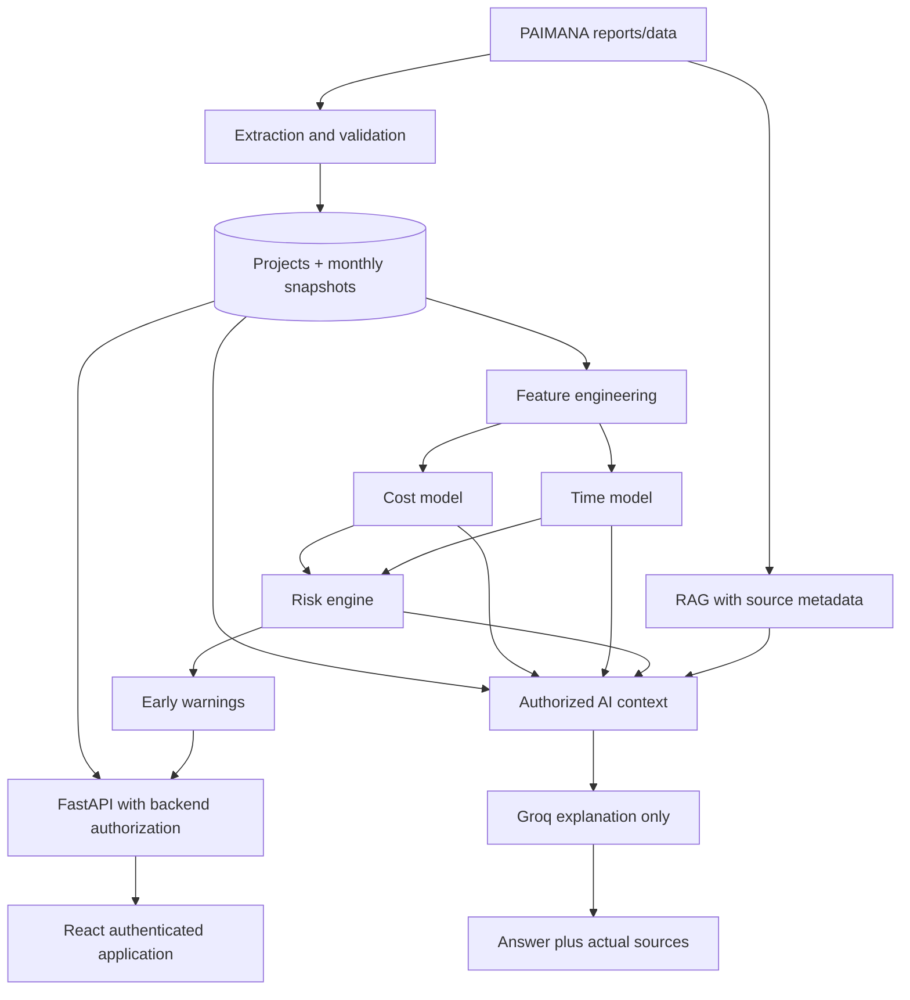

# InfraGuard-AI System Connection Map

**Audit date:** 2026-09-18

This map records the currently observed connections and their gaps. It is intentionally evidence-based; an unverified external integration is marked `NOT CONFIGURED` rather than assumed.

| Component | Input | Processing | Output | API | File location | Database/table | Auth requirement | Failure handling |
|---|---|---|---|---|---|---|---|---|
| Frontend router | Browser path | React Router resolves public/dashboard route | Page component | Browser routes | `frontend/src/App.tsx` | None | Dashboard routes are nested but route protection must be verified | Fallback redirects to landing/dashboard |
| Frontend auth | Login form credentials, stored bearer token | Axios login and `/api/auth/me` session check | User/token state | `POST /api/auth/login`, `GET /api/auth/me` | `frontend/src/contexts/AuthContext.tsx`, `frontend/src/pages/auth/LoginPage.tsx` | `users` via backend | Backend JWT | Clears local session on `/me` failure; no expiry-specific UI |
| Frontend API client | API method arguments, env URL | Axios request interceptor adds bearer token | Typed/partially typed responses | `frontend/src/services/api.ts` methods | `frontend/src/services/api.ts` | None | Bearer token where endpoint requires it | Axios errors pass to callers; centralized status mapping is incomplete |
| Backend API | HTTP requests and bearer tokens | FastAPI dependencies, SQLAlchemy queries, service calls | JSON project/auth/analytics/ML/risk responses | `/health`, `/api/*` routes in `backend/main.py` | `backend/main.py` | SQLAlchemy entities | `get_current_user` for protected routes | HTTP exceptions; raw service exceptions may be included in details |
| Database session | `DATABASE_URL` or local default | SQLAlchemy engine/session lifecycle | DB session | Internal dependency | `backend/database.py` | SQLite fallback `data/processed/infraguard.db`; PostgreSQL only if configured | Server-only environment | Startup can create local tables; external DB status is not separately exposed |
| Authentication | Login credentials, JWT secret | bcrypt verification and JWT encode/decode | Access token and current user | `/api/auth/login`, `/api/auth/me` | `backend/auth.py`, `backend/main.py` | `users`, `roles` | Server JWT secret | Invalid token returns 401; fallback secret currently exists and must be removed |
| RBAC/project scope | User role/org/state/agency and project scope | `check_project_access` | Allow/deny | Applied in project/analytics/ML routes | `backend/auth.py`, `backend/main.py` | `users`, `roles`, `projects` | Authenticated user | Current fallback can allow access; must become deny-by-default |
| Project catalog | Query/filter params | SQLAlchemy project filtering then shared summaries | Paginated project summaries | `GET /api/projects`, `GET /api/projects/search` | `backend/main.py`, `frontend/src/services/api.ts` | `projects`, latest `project_snapshots`, latest `risk_assessments` | Authenticated and authorized | Empty list returned; no explicit data-unavailable distinction |
| Project details | Project code | Project lookup, latest snapshot/risk, ordered history | Project detail/history | `GET /api/projects/{code}`, `/history` | `backend/main.py` | `projects`, `project_snapshots`, `risk_assessments` | Authenticated and project-authorized | 404 for missing project; no source/report data |
| Monthly history/update | Project code and report-month values | Duplicate month check then append snapshot | Snapshot ID/month | `POST /api/projects/{code}/monthly-update` | `backend/main.py` | `project_snapshots`, `audit_logs` | Authenticated/project-authorized; role policy incomplete | 409 duplicate month; validation only partially covers date/order semantics |
| Analytics | Authorized projects and latest values | Python grouping and sums | Overview and group aggregates | `/api/analytics/overview`, `/ministry`, `/sector`, `/state`, `/agency` | `backend/main.py`, frontend dashboard pages | `projects`, snapshots, risk assessments | Authenticated and project scope | Empty aggregation returns zero-like values; completeness needs tests |
| Cost ML | Project code, latest snapshot, latest feature | Feature dictionary then joblib/pandas model inference | Predicted total cost and overrun percent | `POST /api/ml/cost/predict` | `backend/main.py`, `backend/services/ml_service.py`, `src/models/cost_model.py` | `projects`, `project_snapshots`, `project_features`, optional `ml_predictions` | Authenticated and project-authorized | 503 on inference exception; raw exception currently included |
| Time ML | Project code, latest snapshot, latest feature | Schema-based classifier/regressor inference | Risk level, probability, months | `POST /api/ml/time/predict` | `backend/main.py`, `src/models/time_model.py` | `projects`, `project_snapshots`, `project_features`, optional `ml_predictions` | Authenticated and project-authorized | 503 on inference exception; model health not separately exposed |
| Risk engine | Project model dictionary plus cost/time inference | Composite scoring and warnings | Score/category/warnings/explanation | `POST /api/risk/predict` | `backend/services/ml_service.py` | Optional `risk_assessments`; current endpoint does not persist result | Authenticated and project-authorized | 503 on inference exception; batch engine is separate |
| Early warnings | Risk indicators and assessment | Intended rules | Warning records/list | `GET /alerts` not implemented | `src/risk/early_warning.py` | Intended `early_warnings`, absent from ORM | Authenticated and scope-authorized | NOT CONFIGURED |
| Groq AI | User message, optional project code, authorized DB context | Context gathering, system prompt, Groq completion | Answer and context | `POST /api/ai/chat` route exists in lower `backend/main.py` and calls `ai_service` | `backend/services/ai_service.py` | `projects`, snapshots, features, risk assessments; no `ai_queries` ORM | Authenticated; project path uses access helper, portfolio scope needs review | Missing config raises runtime error; health route and redacted structured errors missing |
| RAG/PAIMANA reports | PDFs/report text and metadata | Extraction/chunking/embedding/retrieval | Source-backed context | No verified route | No verified implementation in inspected paths | No report/source/chunk tables observed | Must be authorized by project scope | NOT CONFIGURED |
| Admin | User/org/project/data actions | Intended privileged workflows | User/admin/system state | No verified admin route group | No verified admin backend implementation | Partial `users`, `roles`, `audit_logs`, `uploaded_files` | Must be explicit role dependency | NOT CONFIGURED |
| Reports | Authorized filters/project | Intended aggregation/export | View/download report | No verified report routes | Report schemas only in `backend/schemas.py` | No report model observed | Must be authenticated and scope-authorized | NOT CONFIGURED |
| Audit logging | Privileged action metadata | `log_audit_action` inserts event | Audit row | Internal helper; no verified listing endpoint | `backend/auth.py`, `backend/models.py` | `audit_logs` | Server-side; listing must be admin-authorized | Commit errors are printed and swallowed; secrets must be excluded |
| Frontend visibility | API loading/errors/empty responses | Page-specific state | User-visible status | UI only | `frontend/src/pages/**` | None | Inherits page auth | Coverage is inconsistent; mock presentation data remains |

## Canonical Intended Flow

## Required Connection Repairs

1. Replace default JWT fallback with a required environment secret and fail startup/config health safely when absent.
2. Normalize role names to the documented role contract and make access checks explicitly deny by default.
3. Add route-level authorization for project creation, monthly updates, reports, uploads, admin actions, AI context, and audit-log reads.
4. Add persistent report/source metadata before claiming RAG or source-backed answers.
5. Make cost/time/risk model health and inference status observable without exposing raw exception details.
6. Implement early-warning records from the same authoritative runtime risk result.
7. Expand the frontend API client and UI states only as corresponding backend contracts become verified.
